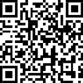

# About Konstruukt

- 👋 Hi, I’m @Konstruukt, a Maker and content creator from Australia 🇦🇺
- 👀 I’m interested in so many thinks, but here I will be mainly uploading resources for my viewing audience
- 🌱 I’m currently working on improving my video editing skills
- 💞️ I’m looking to collaborate on VR related things, and beta test games
- 📫 You can reach me via the Konstruukt Discord server <https://discord.gg/Fv3buZ92pJ> or Twitter [@Konstruukt](https://twitter.com/konstruukt)
- 📹 Please subscribe to the [Konstruukt YouTube channel](https://youtube.com/Konstruukt)
- I would be eternally grateful if you valued my content enough to donate towards the cost of developing future material

    

    

<!---
Konstruukt/Konstruukt is a ✨ special ✨ repository because its `README.md` (this file) appears on your GitHub profile.
You can click the Preview link to take a look at your changes.
--->
